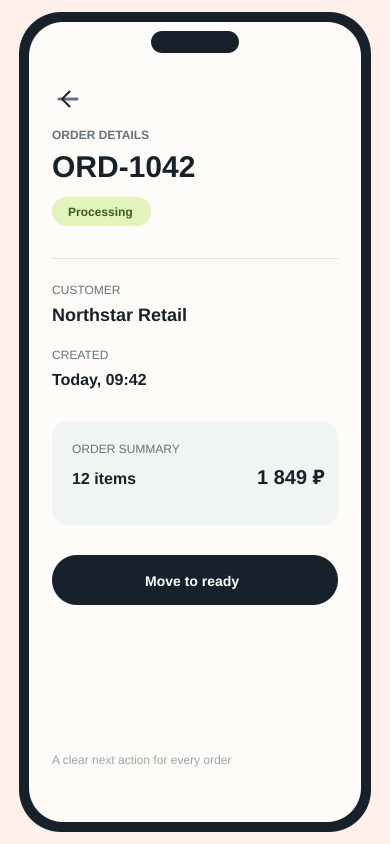
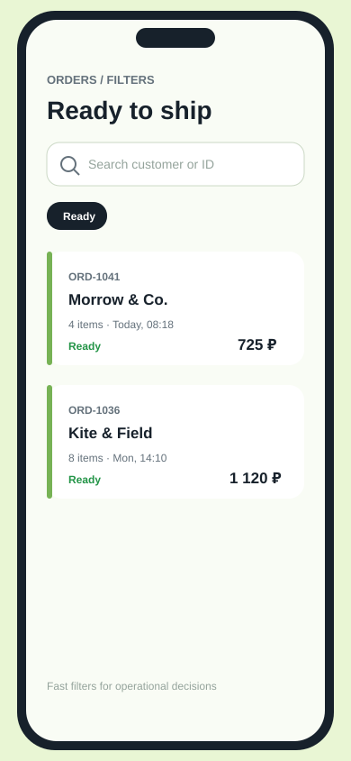

# B2B Marketplace Android

> Мобильный рабочий инструмент для команд, которые обрабатывают B2B‑заказы и не хотят терять время на ручные уточнения.

## Сначала — как это выглядит

<table><tr><td align="center"><br><sub>Все заказы в одном списке</sub></td><td align="center"><br><sub>Понятные детали и следующее действие</sub></td><td align="center"><br><sub>Быстрый фильтр готовых заказов</sub></td></tr></table>

### 30‑секундный walkthrough

<video controls width="360" src="https://github.com/credithelper094-dotcom/b2b-marketplace-android/raw/refs/heads/main/docs/demo/b2b-orders-walkthrough.mp4"></video>

[Если видео не воспроизводится в превью — открыть walkthrough отдельно](https://github.com/credithelper094-dotcom/b2b-marketplace-android/blob/main/docs/demo/b2b-orders-walkthrough.mp4).

В ролике показан доступный demo‑сценарий: список заказов → поиск → фильтр по статусу → обновление данных. Это UI walkthrough текущей reference‑сборки, а не запись production‑backend.

## Что получает бизнес

- Владелец и команда видят актуальный список заказов в одном рабочем сценарии.
- Приоритетные заказы заметны сразу, а статусы не нужно искать по разным чатам.
- Поиск по клиенту или ID сокращает путь до нужной операции.
- Интерфейс оставляет одно понятное следующее действие вместо перегруженного меню.
- Демо работает offline, а сетевой слой уже подготовлен для подключения backend API.

## Что реализовано

- Orders dashboard с loading, empty и error states
- поиск по ID заказа и названию клиента
- фильтры New, Processing, Ready и Delivered
- выделение приоритетных заказов и сортировка
- Retrofit API contract с Gson DTO mapping
- Repository boundary с фильтрацией, сортировкой и `Result` error handling
- ViewModel state через Kotlin `StateFlow`

## Архитектура

```text
MainActivity (Compose UI)
        ↓ collects
OrdersViewModel (StateFlow + user intents)
        ↓ coordinates
Repository (mapping + filtering + Result handling)
        ↓ depends on
ApiService (Retrofit contract)
        ↓ replaceable implementation
DemoApiService (offline sample data)
```

### Ключевые файлы

| Файл | Роль |
| --- | --- |
| `MainActivity.kt` | Экран, поиск, фильтры, карточки заказов и состояния интерфейса |
| `OrdersViewModel.kt` | Состояние экрана, refresh, поиск и статусы |
| `Repository.kt` | Маппинг DTO, сортировка, фильтрация и обработка ошибок |
| `ApiService.kt` | Retrofit endpoint, DTO, mapper и offline implementation |
| `Order.kt` | Доменная модель заказа и статусы |

## Конфигурация сборки

- Android Gradle Plugin: `8.5.2`
- Kotlin: `2.0.21`
- Compile / target SDK: `35`
- Minimum SDK: `26`
- UI: Jetpack Compose + Material 3
- Networking: Retrofit `2.11.0` + Gson converter
- Async state: Kotlin Coroutines + StateFlow

## Запуск

1. Откройте репозиторий в Android Studio Ladybug или новее.
2. Дождитесь синхронизации Gradle из Google и Maven Central.
3. Запустите конфигурацию `app` на эмуляторе или устройстве API 26+.

## Важная граница демо

Проект намеренно небольшой и проверяемый: он показывает полный вертикальный срез сценария заказов, но не выдаёт reference build за готовую production‑систему. `DemoApiService` позволяет запустить интерфейс без сервера, а `RetrofitApiService.create(baseUrl)` готов подключить реальный backend, когда появится адрес API.

## Связанные материалы

[Портфолио](https://github.com/credithelper094-dotcom/freelance-portfolio) · [Профиль GitHub](https://github.com/credithelper094-dotcom)